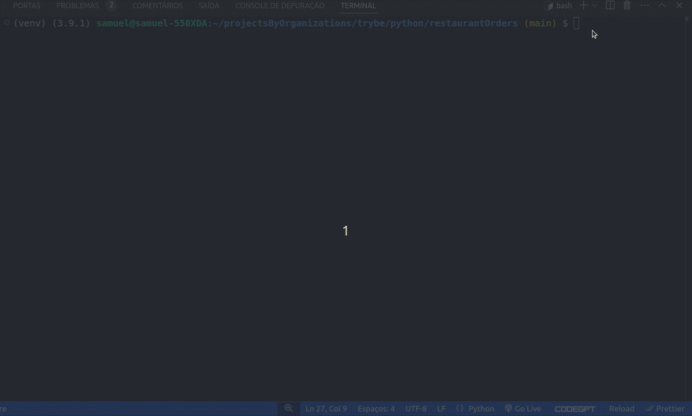

#   🍝🦐 Chapa Quente 🍛🥘 - Menu Generator 

## 🌐
[](https://github.com/SamuelRocha91/restaurantOrders/blob/main/README.md)
[](https://github.com/SamuelRocha91/restaurantOrders/blob/main/README_es.md)
[](https://github.com/SamuelRocha91/restaurantOrders/blob/main/README_en.md)
[](https://github.com/SamuelRocha91/restaurantOrders/blob/main/README_ru.md)
[](https://github.com/SamuelRocha91/restaurantOrders/blob/main/README_ch.md)
[](https://github.com/SamuelRocha91/restaurantOrders/blob/main/README_ar.md)



This project was developed for the **Chapa Quente** restaurant with the aim of creating an efficient menu-building tool, considering customers' dietary restrictions and the availability of ingredients in stock. Currently, recipe and stock management is done inefficiently through CSV files, and this project aims to solve this problem with a more organized and functional approach.

Here is a summary of the sections with `h2`, formatted according to the pattern you desire:

<details>
<summary><h2>Implemented Features</h2></summary>

- Mapping of dishes and recipes.
- Menu generator based on dietary restrictions and ingredient availability.
- Ingredient stock management.# 🍝🦐 Chapa Quente 🍛🥘 - Menu Generator

<h2>🌐</h2>
<ul>
  <li><a href="https://github.com/SamuelRocha91/restaurantOrders" target="_blank">Português</a></li>
  <li><a href="https://github.com/SamuelRocha91/restaurantOrders/blob/main/README_es.md" target="_blank">Español</a></li>
  <li><a href="https://github.com/SamuelRocha91/restaurantOrders/blob/main/README_en.md" target="_blank">English</a></li>
  <li><a href="https://github.com/SamuelRocha91/restaurantOrders/blob/main/README_ru.md" target="_blank">Русский</a></li>
  <li><a href="https://github.com/SamuelRocha91/restaurantOrders/blob/main/README_ch.md" target="_blank">中文</a></li>
  <li><a href="https://github.com/SamuelRocha91/restaurantOrders/blob/main/README_ar.md" target="_blank">العربية</a></li>
</ul>


This project was developed for the **Chapa Quente** restaurant with the goal of creating an efficient tool for building menus, considering customer dietary restrictions and ingredient availability in the inventory. Currently, recipe and inventory management is done inefficiently through CSV files, and this project aims to solve this problem with a more organized and functional approach.

## 🛠️ Implemented Features

- **Dish and recipe mapping**: A class was created that maps dishes to their respective ingredients and quantities.
- **Menu generator**: A class responsible for generating menus based on dietary restrictions and ingredient availability was implemented.
- **Inventory management**: A class was implemented to manage the stock of ingredients, ensuring that available dishes can be prepared with the ingredients in stock.
- **Testing**: Implementation of tests using the `pytest` framework, covering application functionalities such as dish validation, ingredients, and restrictions.

## 🚵 Skills Practiced

- **Using Hashmaps with Dict and Set**: Usage of Python's `dict` and `set` structures to manage dishes and ingredients.
- **Software testing**: Practice of writing unit tests for classes using `pytest`.
- **Object-Oriented Programming**: Implementation of classes, methods, and attributes that follow object-oriented principles.

## 📋 Requirements

- Python 3.8 or higher
- Pip (Python's package manager)

## 🔧 Installation and Execution

Follow the instructions below to clone and run the project on your local machine:

### 1. Clone the repository

```bash
git clone git@github.com:SamuelRocha91/restaurantOrders.git
```

### 2. Navigate to the project directory

```bash
cd restaurantOrders
```

### 3. Create a virtual environment (optional, but recommended)

```bash
python3 -m venv venv
source venv/bin/activate  # On Windows, use: venv\Scripts\activate
```

### 4. Install dependencies

Install the dependencies listed in the `requirements.txt` and `dev-requirements.txt` files:

```bash
pip install -r dev-requirements.txt
```

### 5. Run the tests

To run the automated tests, use the following command:

```bash
pytest --cov=src --cov-report=term-missing
```

## 📝 File Structure

The project structure is organized as follows:

```
.
├── src/
│   ├── models/
│   │   ├── dish.py            # Implementation of the Dish class
│   │   ├── ingredient.py      # Implementation of the Ingredient class
│   │   └── stock.py           # Implementation of the Stock class (Inventory Management)
├── tests/
│   ├── test_dish.py           # Tests for the Dish class
│   ├── test_ingredient.py     # Tests for the Ingredient class
│   └── test_stock.py          # Tests for the Stock class
├── dev-requirements.txt       # Dependencies for development and testing
├── requirements.txt           # Main project dependencies
└── README.md                  # Project documentation
```

## 📦 Dependencies

Project dependencies include:

- [black](https://github.com/psf/black): Code formatter.
- [faker](https://github.com/joke2k/faker): Fake data generation for testing.
- [flake8](https://github.com/PyCQA/flake8): Linting tool.
- [httpx](https://www.python-httpx.org/): HTTP requests library.
- [pytest](https://pytest.org/): Testing framework.
- [pytest-cov](https://github.com/pytest-dev/pytest-cov): Test coverage reports.
- [pytest-json](https://github.com/nicoddemus/pytest-json): Plugin for JSON test output.
- [pytest-unordered](https://github.com/altendky/pytest-unordered): Plugin to verify unordered set equality.

<details>
<summary><h2>Requirements</h2></summary>

- Python 3.8 or higher.
- Pip (Python package manager).

</details>

<details>
<summary><h2>Installation and Execution</h2></summary>

1. Clone the repository.
2. Navigate to the project directory.
3. Create a virtual environment (optional).
4. Install the dependencies.
5. Run the automated tests.

</details>

<details>
<summary><h2>File Structure</h2></summary>

```
.
├── src/
│   ├── models/
│   │   ├── dish.py            # Implementation of the Dish class
│   │   ├── ingredient.py      # Implementation of the Ingredient class
│   │   └── stock.py           # Implementation of the Stock class
├── tests/
│   ├── test_dish.py           # Tests for the Dish class
│   ├── test_ingredient.py     # Tests for the Ingredient class
│   └── test_stock.py          # Tests for the Stock class
├── dev-requirements.txt       # Development and testing dependencies
├── requirements.txt           # Main project dependencies
└── README.md                  # Project documentation
```

</details>

<details>
<summary><h2>Dependencies</h2></summary>

- [black](https://github.com/psf/black): Code formatting.
- [faker](https://github.com/joke2k/faker): Generation of fake data for testing.
- [flake8](https://github.com/PyCQA/flake8): Linting tool.
- [httpx](https://www.python-httpx.org/): HTTP request library.
- [pytest](https://pytest.org/): Testing framework.
- [pytest-cov](https://github.com/pytest-dev/pytest-cov): Test coverage reports.
- [pytest-json](https://github.com/nicoddemus/pytest-json): Plugin for JSON test output.
- [pytest-unordered](https://github.com/altendky/pytest-unordered): Plugin to check set equality in an unordered manner.

</details>

<details>
<summary><h2>Other Projects</h2></summary>

-  [Scripts](https://github.com/SamuelRocha91/scripts/blob/main/README_en.md)
-  [Algorithms](https://github.com/SamuelRocha91/Algorithms/blob/main/README_en.md)
-  [Trybe is not google](https://github.com/SamuelRocha91/trybeIsNotGoogle/blob/main/README_en.md)

</details>
