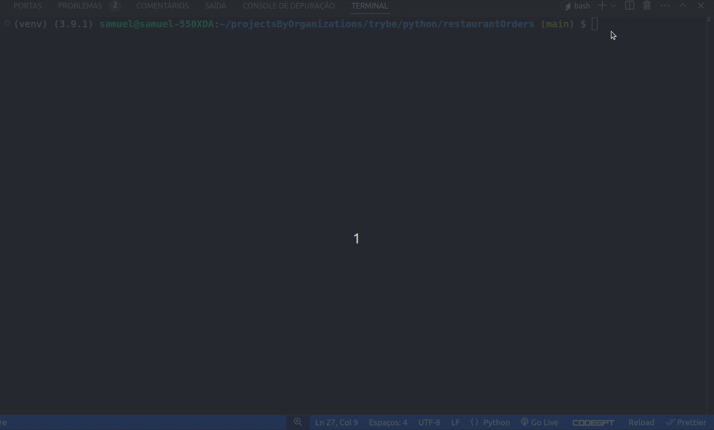

#   🍝🦐 Chapa Quente 🍛🥘 - Generador de Menús 

## 🌐 
[](https://github.com/SamuelRocha91/restaurantOrders/blob/main/README.md)
[](https://github.com/SamuelRocha91/restaurantOrders/blob/main/README_es.md)
[](https://github.com/SamuelRocha91/restaurantOrders/blob/main/README_en.md)
[](https://github.com/SamuelRocha91/restaurantOrders/blob/main/README_ru.md)
[](https://github.com/SamuelRocha91/restaurantOrders/blob/main/README_ch.md)
[](https://github.com/SamuelRocha91/restaurantOrders/blob/main/README_ar.md)



Este proyecto fue desarrollado para el restaurante **Chapa Quente** con el objetivo de crear una herramienta eficiente para la construcción de menús, considerando las restricciones alimentarias de los clientes y la disponibilidad de ingredientes en el stock. Actualmente, la gestión de recetas y stock se realiza de manera ineficiente a través de archivos CSV, y este proyecto tiene como finalidad solucionar este problema con un enfoque más organizado y funcional.

Aquí hay un resumen de las secciones con `h2`, formateado según el patrón que deseas:

<details>
<summary><h2>Características Implementadas</h2></summary>

- Mapeo de platos y recetas.
- Generador de menús basado en restricciones alimentarias y disponibilidad de ingredientes.
- Gestión de stock de ingredientes.
- Implementación de pruebas con el framework `pytest`.

</details>

<details>
<summary><h2>Habilidades Practicadas</h2></summary>

- Uso de Hashmaps con Dict y Set.
- Pruebas de software con `pytest`.
- Implementación de clases y principios de programación orientada a objetos.

</details>

<details>
<summary><h2>Requisitos</h2></summary>

- Python 3.8 o superior.
- Pip (gestor de paquetes de Python).

</details>

<details>
<summary><h2>Instalación y Ejecución</h2></summary>

1. Clona el repositorio.
2. Navega hasta el directorio del proyecto.
3. Crea un entorno virtual (opcional).
4. Instala las dependencias.
5. Ejecuta las pruebas automatizadas.

</details>

<details>
<summary><h2>Estructura de Archivos</h2></summary>

```
.
├── src/
│   ├── models/
│   │   ├── dish.py            # Implementación de la clase Dish
│   │   ├── ingredient.py      # Implementación de la clase Ingredient
│   │   └── stock.py           # Implementación de la clase Stock
├── tests/
│   ├── test_dish.py           # Pruebas para la clase Dish
│   ├── test_ingredient.py     # Pruebas para la clase Ingredient
│   └── test_stock.py          # Pruebas para la clase Stock
├── dev-requirements.txt       # Dependencias para el desarrollo y pruebas
├── requirements.txt           # Dependencias principales del proyecto
└── README.md                  # Documentación del proyecto
```

</details>

<details>
<summary><h2>Dependencias</h2></summary>

- [black](https://github.com/psf/black): Formateo de código.
- [faker](https://github.com/joke2k/faker): Generación de datos falsos para pruebas.
- [flake8](https://github.com/PyCQA/flake8): Herramienta de linting.
- [httpx](https://www.python-httpx.org/): Biblioteca de solicitudes HTTP.
- [pytest](https://pytest.org/): Framework de pruebas.
- [pytest-cov](https://github.com/pytest-dev/pytest-cov): Informes de cobertura de pruebas.
- [pytest-json](https://github.com/nicoddemus/pytest-json): Plugin para salida JSON de las pruebas.
- [pytest-unordered](https://github.com/altendky/pytest-unordered): Plugin para verificar la igualdad de conjuntos de forma no ordenada.

</details>

<details>
<summary><h2>Otros Proyectos</h2></summary>

-  [Scripts](https://github.com/SamuelRocha91/scripts/blob/main/README_es.md)
-  [Algorithms](https://github.com/SamuelRocha91/Algorithms/blob/main/README_es.md)
-  [Trybe is not google](https://github.com/SamuelRocha91/trybeIsNotGoogle/blob/main/README_es.md)

</details>